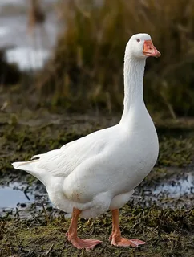

А не пойти ли тебе нахуй, случаем, А?

А не пойти ли тебе нахуй, случаем, А?

А не пойти ли тебе нахуй, случаем, А?

А не пойти ли тебе нахуй, случаем, А?

А не пойти ли тебе нахуй, случаем, А?

А не пойти ли тебе нахуй, случаем, А?

А не пойти ли тебе нахуй, случаем, А?

А не пойти ли тебе нахуй, случаем, А?

А не пойти ли тебе нахуй, случаем, А?

А не пойти ли тебе нахуй, случаем, А?

А не пойти ли тебе нахуй, случаем, А?

А не пойти ли тебе нахуй, случаем, А?

А не пойти ли тебе нахуй, случаем, А?

А не пойти ли тебе нахуй, случаем, А?

А не пойти ли тебе нахуй, случаем, А?

А не пойти ли тебе нахуй, случаем, А?

А не пойти ли тебе нахуй, случаем, А?

А не пойти ли тебе нахуй, случаем, А?

А не пойти ли тебе нахуй, случаем, А?

А не пойти ли тебе нахуй, случаем, А?

А не пойти ли тебе нахуй, случаем, А?

А не пойти ли тебе нахуй, случаем, А?

А не пойти ли тебе нахуй, случаем, А?

А не пойти ли тебе нахуй, случаем, А?

А не пойти ли тебе нахуй, случаем, А?

А не пойти ли тебе нахуй, случаем, А?

А не пойти ли тебе нахуй, случаем, А?

А не пойти ли тебе нахуй, случаем, А?

А не пойти ли тебе нахуй, случаем, А?

А не пойти ли тебе нахуй, случаем, А?

А не пойти ли тебе нахуй, случаем, А?

А не пойти ли тебе нахуй, случаем, А?

А не пойти ли тебе нахуй, случаем, А?

А не пойти ли тебе нахуй, случаем, А?

А не пойти ли тебе нахуй, случаем, А?

А не пойти ли тебе нахуй, случаем, А?

А не пойти ли тебе нахуй, случаем, А?

А не пойти ли тебе нахуй, случаем, А?

А не пойти ли тебе нахуй, случаем, А?

А не пойти ли тебе нахуй, случаем, А?

А не пойти ли тебе нахуй, случаем, А?

А не пойти ли тебе нахуй, случаем, А?

А не пойти ли тебе нахуй, случаем, А?

А не пойти ли тебе нахуй, случаем, А?

А не пойти ли тебе нахуй, случаем, А?

А не пойти ли тебе нахуй, случаем, А?

А не пойти ли тебе нахуй, случаем, А?

А не пойти ли тебе нахуй, случаем, А?

А не пойти ли тебе нахуй, случаем, А?

А не пойти ли тебе нахуй, случаем, А?

А не пойти ли тебе нахуй, случаем, А?

А не пойти ли тебе нахуй, случаем, А?

А не пойти ли тебе нахуй, случаем, А?

А не пойти ли тебе нахуй, случаем, А?

А не пойти ли тебе нахуй, случаем, А?

А не пойти ли тебе нахуй, случаем, А?

А не пойти ли тебе нахуй, случаем, А?

А не пойти ли тебе нахуй, случаем, А?

А не пойти ли тебе нахуй, случаем, А?

А не пойти ли тебе нахуй, случаем, А?

А не пойти ли тебе нахуй, случаем, А?

А не пойти ли тебе нахуй, случаем, А?

А не пойти ли тебе нахуй, случаем, А?

А не пойти ли тебе нахуй, случаем, А?

А не пойти ли тебе нахуй, случаем, А?

А не пойти ли тебе нахуй, случаем, А?

А не пойти ли тебе нахуй, случаем, А?

А не пойти ли тебе нахуй, случаем, А?

А не пойти ли тебе нахуй, случаем, А?

А не пойти ли тебе нахуй, случаем, А?

А не пойти ли тебе нахуй, случаем, А?

А не пойти ли тебе нахуй, случаем, А?

А не пойти ли тебе нахуй, случаем, А?

А не пойти ли тебе нахуй, случаем, А?

А не пойти ли тебе нахуй, случаем, А?

А не пойти ли тебе нахуй, случаем, А?

А не пойти ли тебе нахуй, случаем, А?

А не пойти ли тебе нахуй, случаем, А?

А не пойти ли тебе нахуй, случаем, А?

А не пойти ли тебе нахуй, случаем, А?

А не пойти ли тебе нахуй, случаем, А?

А не пойти ли тебе нахуй, случаем, А?

А не пойти ли тебе нахуй, случаем, А?

А не пойти ли тебе нахуй, случаем, А?

А не пойти ли тебе нахуй, случаем, А?

А не пойти ли тебе нахуй, случаем, А?

А не пойти ли тебе нахуй, случаем, А?

А не пойти ли тебе нахуй, случаем, А?

А не пойти ли тебе нахуй, случаем, А?

А не пойти ли тебе нахуй, случаем, А?

А не пойти ли тебе нахуй, случаем, А?

А не пойти ли тебе нахуй, случаем, А?

А не пойти ли тебе нахуй, случаем, А?

ТЫ ГЕЙ!

А не пойти ли тебе нахуй, случаем, А?

А не пойти ли тебе нахуй, случаем, А?

А не пойти ли тебе нахуй, случаем, А?

А не пойти ли тебе нахуй, случаем, А?

А не пойти ли тебе нахуй, случаем, А?

А не пойти ли тебе нахуй, случаем, А?

А не пойти ли тебе нахуй, случаем, А?

А не пойти ли тебе нахуй, случаем, А?

А не пойти ли тебе нахуй, случаем, А?

А не пойти ли тебе нахуй, случаем, А?

А не пойти ли тебе нахуй, случаем, А?

А не пойти ли тебе нахуй, случаем, А?

А не пойти ли тебе нахуй, случаем, А?

А не пойти ли тебе нахуй, случаем, А?

А не пойти ли тебе нахуй, случаем, А?

А не пойти ли тебе нахуй, случаем, А?

А не пойти ли тебе нахуй, случаем, А?

А не пойти ли тебе нахуй, случаем, А?

А не пойти ли тебе нахуй, случаем, А?

А не пойти ли тебе нахуй, случаем, А?

А не пойти ли тебе нахуй, случаем, А?

А не пойти ли тебе нахуй, случаем, А?

А не пойти ли тебе нахуй, случаем, А?

А не пойти ли тебе нахуй, случаем, А?

А не пойти ли тебе нахуй, случаем, А?

А не пойти ли тебе нахуй, случаем, А?

А не пойти ли тебе нахуй, случаем, А?

А не пойти ли тебе нахуй, случаем, А?

А не пойти ли тебе нахуй, случаем, А?

А не пойти ли тебе нахуй, случаем, А?

А не пойти ли тебе нахуй, случаем, А?

А не пойти ли тебе нахуй, случаем, А?

А не пойти ли тебе нахуй, случаем, А?

А не пойти ли тебе нахуй, случаем, А?

А не пойти ли тебе нахуй, случаем, А?

А не пойти ли тебе нахуй, случаем, А?

А не пойти ли тебе нахуй, случаем, А?

А не пойти ли тебе нахуй, случаем, А?

А не пойти ли тебе нахуй, случаем, А?

А не пойти ли тебе нахуй, случаем, А?

А не пойти ли тебе нахуй, случаем, А?

А не пойти ли тебе нахуй, случаем, А?

А не пойти ли тебе нахуй, случаем, А?

А не пойти ли тебе нахуй, случаем, А?

А не пойти ли тебе нахуй, случаем, А?

А не пойти ли тебе нахуй, случаем, А?

А не пойти ли тебе нахуй, случаем, А?

А не пойти ли тебе нахуй, случаем, А?

А не пойти ли тебе нахуй, случаем, А?

А не пойти ли тебе нахуй, случаем, А?

А не пойти ли тебе нахуй, случаем, А?

А не пойти ли тебе нахуй, случаем, А?

А не пойти ли тебе нахуй, случаем, А?

А не пойти ли тебе нахуй, случаем, А?

А не пойти ли тебе нахуй, случаем, А?

А не пойти ли тебе нахуй, случаем, А?

А не пойти ли тебе нахуй, случаем, А?

А не пойти ли тебе нахуй, случаем, А?

А не пойти ли тебе нахуй, случаем, А?

А не пойти ли тебе нахуй, случаем, А?

А не пойти ли тебе нахуй, случаем, А?

А не пойти ли тебе нахуй, случаем, А?

А не пойти ли тебе нахуй, случаем, А?

А не пойти ли тебе нахуй, случаем, А?

А не пойти ли тебе нахуй, случаем, А?

А не пойти ли тебе нахуй, случаем, А?

А не пойти ли тебе нахуй, случаем, А?

А не пойти ли тебе нахуй, случаем, А?

А не пойти ли тебе нахуй, случаем, А?

А не пойти ли тебе нахуй, случаем, А?

А не пойти ли тебе нахуй, случаем, А?

А не пойти ли тебе нахуй, случаем, А?

А не пойти ли тебе нахуй, случаем, А?

А не пойти ли тебе нахуй, случаем, А?

А не пойти ли тебе нахуй, случаем, А?

А не пойти ли тебе нахуй, случаем, А?

А не пойти ли тебе нахуй, случаем, А?

А не пойти ли тебе нахуй, случаем, А?

А не пойти ли тебе нахуй, случаем, А?

А не пойти ли тебе нахуй, случаем, А?

А не пойти ли тебе нахуй, случаем, А?

А не пойти ли тебе нахуй, случаем, А?

А не пойти ли тебе нахуй, случаем, А?

А не пойти ли тебе нахуй, случаем, А?

А не пойти ли тебе нахуй, случаем, А?

А не пойти ли тебе нахуй, случаем, А?

А не пойти ли тебе нахуй, случаем, А?

А не пойти ли тебе нахуй, случаем, А?

А не пойти ли тебе нахуй, случаем, А?

А не пойти ли тебе нахуй, случаем, А?

А не пойти ли тебе нахуй, случаем, А?

А не пойти ли тебе нахуй, случаем, А?

А не пойти ли тебе нахуй, случаем, А?

А не пойти ли тебе нахуй, случаем, А?

А не пойти ли тебе нахуй, случаем, А?

А не пойти ли тебе нахуй, случаем, А?

А не пойти ли тебе нахуй, случаем, А?

А не пойти ли тебе нахуй, случаем, А?

А не пойти ли тебе нахуй, случаем, А?

А не пойти ли тебе нахуй, случаем, А?

А не пойти ли тебе нахуй, случаем, А?

А не пойти ли тебе нахуй, случаем, А?

А не пойти ли тебе нахуй, случаем, А?

А не пойти ли тебе нахуй, случаем, А?

А не пойти ли тебе нахуй, случаем, А?

А не пойти ли тебе нахуй, случаем, А?

А не пойти ли тебе нахуй, случаем, А?

А не пойти ли тебе нахуй, случаем, А?

А не пойти ли тебе нахуй, случаем, А?

А не пойти ли тебе нахуй, случаем, А?

А не пойти ли тебе нахуй, случаем, А?

А не пойти ли тебе нахуй, случаем, А?

А не пойти ли тебе нахуй, случаем, А?

А не пойти ли тебе нахуй, случаем, А?

А не пойти ли тебе нахуй, случаем, А?

А не пойти ли тебе нахуй, случаем, А?

А не пойти ли тебе нахуй, случаем, А?

А не пойти ли тебе нахуй, случаем, А?

А не пойти ли тебе нахуй, случаем, А?

А не пойти ли тебе нахуй, случаем, А?

А не пойти ли тебе нахуй, случаем, А?

А не пойти ли тебе нахуй, случаем, А?

А не пойти ли тебе нахуй, случаем, А?

А не пойти ли тебе нахуй, случаем, А?

А не пойти ли тебе нахуй, случаем, А?

А не пойти ли тебе нахуй, случаем, А?

А не пойти ли тебе нахуй, случаем, А?

А не пойти ли тебе нахуй, случаем, А?

А не пойти ли тебе нахуй, случаем, А?

А не пойти ли тебе нахуй, случаем, А?

А не пойти ли тебе нахуй, случаем, А?

А не пойти ли тебе нахуй, случаем, А?

А не пойти ли тебе нахуй, случаем, А?

А не пойти ли тебе нахуй, случаем, А?

А не пойти ли тебе нахуй, случаем, А?

А не пойти ли тебе нахуй, случаем, А?

А не пойти ли тебе нахуй, случаем, А?

А не пойти ли тебе нахуй, случаем, А?

А не пойти ли тебе нахуй, случаем, А?

А не пойти ли тебе нахуй, случаем, А?

А не пойти ли тебе нахуй, случаем, А?

А не пойти ли тебе нахуй, случаем, А?

А не пойти ли тебе нахуй, случаем, А?

А не пойти ли тебе нахуй, случаем, А?

А не пойти ли тебе нахуй, случаем, А?

А не пойти ли тебе нахуй, случаем, А?

А не пойти ли тебе нахуй, случаем, А?

А не пойти ли тебе нахуй, случаем, А?

А не пойти ли тебе нахуй, случаем, А?

А не пойти ли тебе нахуй, случаем, А?

А не пойти ли тебе нахуй, случаем, А?

А не пойти ли тебе нахуй, случаем, А?

А не пойти ли тебе нахуй, случаем, А?

А не пойти ли тебе нахуй, случаем, А?

А не пойти ли тебе нахуй, случаем, А?

А не пойти ли тебе нахуй, случаем, А?

А не пойти ли тебе нахуй, случаем, А?

А не пойти ли тебе нахуй, случаем, А?

А не пойти ли тебе нахуй, случаем, А?

А не пойти ли тебе нахуй, случаем, А?

А не пойти ли тебе нахуй, случаем, А?

А не пойти ли тебе нахуй, случаем, А?

А не пойти ли тебе нахуй, случаем, А?

А не пойти ли тебе нахуй, случаем, А?

А не пойти ли тебе нахуй, случаем, А?

А не пойти ли тебе нахуй, случаем, А?

А не пойти ли тебе нахуй, случаем, А?

А не пойти ли тебе нахуй, случаем, А?

А не пойти ли тебе нахуй, случаем, А?

А не пойти ли тебе нахуй, случаем, А?

А не пойти ли тебе нахуй, случаем, А?

А не пойти ли тебе нахуй, случаем, А?

А не пойти ли тебе нахуй, случаем, А?

А не пойти ли тебе нахуй, случаем, А?

А не пойти ли тебе нахуй, случаем, А?

А не пойти ли тебе нахуй, случаем, А?

А не пойти ли тебе нахуй, случаем, А?

А не пойти ли тебе нахуй, случаем, А?

А не пойти ли тебе нахуй, случаем, А?

А не пойти ли тебе нахуй, случаем, А?

А не пойти ли тебе нахуй, случаем, А?

А не пойти ли тебе нахуй, случаем, А?

А не пойти ли тебе нахуй, случаем, А?

А не пойти ли тебе нахуй, случаем, А?

А не пойти ли тебе нахуй, случаем, А?

А не пойти ли тебе нахуй, случаем, А?

А не пойти ли тебе нахуй, случаем, А?

А не пойти ли тебе нахуй, случаем, А?

А не пойти ли тебе нахуй, случаем, А?

А не пойти ли тебе нахуй, случаем, А?

А не пойти ли тебе нахуй, случаем, А?

А не пойти ли тебе нахуй, случаем, А?

А не пойти ли тебе нахуй, случаем, А?

А не пойти ли тебе нахуй, случаем, А?

А не пойти ли тебе нахуй, случаем, А?

А не пойти ли тебе нахуй, случаем, А?

А не пойти ли тебе нахуй, случаем, А?

А не пойти ли тебе нахуй, случаем, А?

А не пойти ли тебе нахуй, случаем, А?

А не пойти ли тебе нахуй, случаем, А?

А не пойти ли тебе нахуй, случаем, А?

А не пойти ли тебе нахуй, случаем, А?

А не пойти ли тебе нахуй, случаем, А?

А не пойти ли тебе нахуй, случаем, А?

А не пойти ли тебе нахуй, случаем, А?

А не пойти ли тебе нахуй, случаем, А?

А не пойти ли тебе нахуй, случаем, А?

А не пойти ли тебе нахуй, случаем, А?

А не пойти ли тебе нахуй, случаем, А?

А не пойти ли тебе нахуй, случаем, А?

А не пойти ли тебе нахуй, случаем, А?

А не пойти ли тебе нахуй, случаем, А?

А не пойти ли тебе нахуй, случаем, А?

А не пойти ли тебе нахуй, случаем, А?

А не пойти ли тебе нахуй, случаем, А?

А не пойти ли тебе нахуй, случаем, А?

А не пойти ли тебе нахуй, случаем, А?

А не пойти ли тебе нахуй, случаем, А?

А не пойти ли тебе нахуй, случаем, А?

А не пойти ли тебе нахуй, случаем, А?

А не пойти ли тебе нахуй, случаем, А?

А не пойти ли тебе нахуй, случаем, А?

А не пойти ли тебе нахуй, случаем, А?

А не пойти ли тебе нахуй, случаем, А?

А не пойти ли тебе нахуй, случаем, А?

А не пойти ли тебе нахуй, случаем, А?

А не пойти ли тебе нахуй, случаем, А?

А не пойти ли тебе нахуй, случаем, А?

А не пойти ли тебе нахуй, случаем, А?

А не пойти ли тебе нахуй, случаем, А?

А не пойти ли тебе нахуй, случаем, А?

А не пойти ли тебе нахуй, случаем, А?

А не пойти ли тебе нахуй, случаем, А?

А не пойти ли тебе нахуй, случаем, А?

А не пойти ли тебе нахуй, случаем, А?

А не пойти ли тебе нахуй, случаем, А?

А не пойти ли тебе нахуй, случаем, А?

А не пойти ли тебе нахуй, случаем, А?

А не пойти ли тебе нахуй, случаем, А?

А не пойти ли тебе нахуй, случаем, А?

А не пойти ли тебе нахуй, случаем, А?

А не пойти ли тебе нахуй, случаем, А?

А не пойти ли тебе нахуй, случаем, А?

А не пойти ли тебе нахуй, случаем, А?

А не пойти ли тебе нахуй, случаем, А?

А не пойти ли тебе нахуй, случаем, А?

А не пойти ли тебе нахуй, случаем, А?

А не пойти ли тебе нахуй, случаем, А?

А не пойти ли тебе нахуй, случаем, А?

А не пойти ли тебе нахуй, случаем, А?

А не пойти ли тебе нахуй, случаем, А?

А не пойти ли тебе нахуй, случаем, А?

А не пойти ли тебе нахуй, случаем, А?

А не пойти ли тебе нахуй, случаем, А?

А не пойти ли тебе нахуй, случаем, А?

А не пойти ли тебе нахуй, случаем, А?

А не пойти ли тебе нахуй, случаем, А?

А не пойти ли тебе нахуй, случаем, А?

А не пойти ли тебе нахуй, случаем, А?

А не пойти ли тебе нахуй, случаем, А?

А не пойти ли тебе нахуй, случаем, А?

А не пойти ли тебе нахуй, случаем, А?

А не пойти ли тебе нахуй, случаем, А?

А не пойти ли тебе нахуй, случаем, А?

А не пойти ли тебе нахуй, случаем, А?

А не пойти ли тебе нахуй, случаем, А?

А не пойти ли тебе нахуй, случаем, А?

А не пойти ли тебе нахуй, случаем, А?

А не пойти ли тебе нахуй, случаем, А?

А не пойти ли тебе нахуй, случаем, А?

А не пойти ли тебе нахуй, случаем, А?

А не пойти ли тебе нахуй, случаем, А?

А не пойти ли тебе нахуй, случаем, А?

А не пойти ли тебе нахуй, случаем, А?

А не пойти ли тебе нахуй, случаем, А?

А не пойти ли тебе нахуй, случаем, А?

А не пойти ли тебе нахуй, случаем, А?

А не пойти ли тебе нахуй, случаем, А?

А не пойти ли тебе нахуй, случаем, А?

А не пойти ли тебе нахуй, случаем, А?

А не пойти ли тебе нахуй, случаем, А?

А не пойти ли тебе нахуй, случаем, А?

А не пойти ли тебе нахуй, случаем, А?

А не пойти ли тебе нахуй, случаем, А?

А не пойти ли тебе нахуй, случаем, А?

А не пойти ли тебе нахуй, случаем, А?

А не пойти ли тебе нахуй, случаем, А?

А не пойти ли тебе нахуй, случаем, А?

А не пойти ли тебе нахуй, случаем, А?

А не пойти ли тебе нахуй, случаем, А?

А не пойти ли тебе нахуй, случаем, А?

А не пойти ли тебе нахуй, случаем, А?

А не пойти ли тебе нахуй, случаем, А?

А не пойти ли тебе нахуй, случаем, А?

А не пойти ли тебе нахуй, случаем, А?

А не пойти ли тебе нахуй, случаем, А?

А не пойти ли тебе нахуй, случаем, А?

А не пойти ли тебе нахуй, случаем, А?

А не пойти ли тебе нахуй, случаем, А?

А не пойти ли тебе нахуй, случаем, А?

А не пойти ли тебе нахуй, случаем, А?

А не пойти ли тебе нахуй, случаем, А?

А не пойти ли тебе нахуй, случаем, А?

А не пойти ли тебе нахуй, случаем, А?

А не пойти ли тебе нахуй, случаем, А?

А не пойти ли тебе нахуй, случаем, А?

А не пойти ли тебе нахуй, случаем, А?

А не пойти ли тебе нахуй, случаем, А?

А не пойти ли тебе нахуй, случаем, А?

А не пойти ли тебе нахуй, случаем, А?

А не пойти ли тебе нахуй, случаем, А?

А не пойти ли тебе нахуй, случаем, А?

А не пойти ли тебе нахуй, случаем, А?

А не пойти ли тебе нахуй, случаем, А?

А не пойти ли тебе нахуй, случаем, А?

А не пойти ли тебе нахуй, случаем, А?

А не пойти ли тебе нахуй, случаем, А?

А не пойти ли тебе нахуй, случаем, А?

А не пойти ли тебе нахуй, случаем, А?

А не пойти ли тебе нахуй, случаем, А?

А не пойти ли тебе нахуй, случаем, А?

А не пойти ли тебе нахуй, случаем, А?

А не пойти ли тебе нахуй, случаем, А?

А не пойти ли тебе нахуй, случаем, А?

А не пойти ли тебе нахуй, случаем, А?

А не пойти ли тебе нахуй, случаем, А?

А не пойти ли тебе нахуй, случаем, А?

А не пойти ли тебе нахуй, случаем, А?

А не пойти ли тебе нахуй, случаем, А?

А не пойти ли тебе нахуй, случаем, А?

А не пойти ли тебе нахуй, случаем, А?

А не пойти ли тебе нахуй, случаем, А?

А не пойти ли тебе нахуй, случаем, А?

А не пойти ли тебе нахуй, случаем, А?

А не пойти ли тебе нахуй, случаем, А?

А не пойти ли тебе нахуй, случаем, А?

А не пойти ли тебе нахуй, случаем, А?

А не пойти ли тебе нахуй, случаем, А?

А не пойти ли тебе нахуй, случаем, А?

А не пойти ли тебе нахуй, случаем, А?

А не пойти ли тебе нахуй, случаем, А?

А не пойти ли тебе нахуй, случаем, А?

А не пойти ли тебе нахуй, случаем, А?

А не пойти ли тебе нахуй, случаем, А?

А не пойти ли тебе нахуй, случаем, А?

А не пойти ли тебе нахуй, случаем, А?

А не пойти ли тебе нахуй, случаем, А?

А не пойти ли тебе нахуй, случаем, А?

А не пойти ли тебе нахуй, случаем, А?

А не пойти ли тебе нахуй, случаем, А?

А не пойти ли тебе нахуй, случаем, А?

А не пойти ли тебе нахуй, случаем, А?

А не пойти ли тебе нахуй, случаем, А?

А не пойти ли тебе нахуй, случаем, А?

А не пойти ли тебе нахуй, случаем, А?

А не пойти ли тебе нахуй, случаем, А?

А не пойти ли тебе нахуй, случаем, А?

А не пойти ли тебе нахуй, случаем, А?

А не пойти ли тебе нахуй, случаем, А?

А не пойти ли тебе нахуй, случаем, А?

А не пойти ли тебе нахуй, случаем, А?

А не пойти ли тебе нахуй, случаем, А?

А не пойти ли тебе нахуй, случаем, А?

А не пойти ли тебе нахуй, случаем, А?

А не пойти ли тебе нахуй, случаем, А?

А не пойти ли тебе нахуй, случаем, А?

А не пойти ли тебе нахуй, случаем, А?

А не пойти ли тебе нахуй, случаем, А?

А не пойти ли тебе нахуй, случаем, А?

А не пойти ли тебе нахуй, случаем, А?

А не пойти ли тебе нахуй, случаем, А?

А не пойти ли тебе нахуй, случаем, А?

СПОКОЙНОЙ НОЧИ НЕГР 

А не пойти ли тебе нахуй, случаем, А?

А не пойти ли тебе нахуй, случаем, А?

А не пойти ли тебе нахуй, случаем, А?

А не пойти ли тебе нахуй, случаем, А?

А не пойти ли тебе нахуй, случаем, А?

А не пойти ли тебе нахуй, случаем, А?

А не пойти ли тебе нахуй, случаем, А?

А не пойти ли тебе нахуй, случаем, А?

А не пойти ли тебе нахуй, случаем, А?

А не пойти ли тебе нахуй, случаем, А?

А не пойти ли тебе нахуй, случаем, А?

А не пойти ли тебе нахуй, случаем, А?

А не пойти ли тебе нахуй, случаем, А?

А не пойти ли тебе нахуй, случаем, А?

А не пойти ли тебе нахуй, случаем, А?

А не пойти ли тебе нахуй, случаем, А?

А не пойти ли тебе нахуй, случаем, А?

А не пойти ли тебе нахуй, случаем, А?

А не пойти ли тебе нахуй, случаем, А?

А не пойти ли тебе нахуй, случаем, А?

А не пойти ли тебе нахуй, случаем, А?

А не пойти ли тебе нахуй, случаем, А?

А не пойти ли тебе нахуй, случаем, А?

А не пойти ли тебе нахуй, случаем, А?

А не пойти ли тебе нахуй, случаем, А?

А не пойти ли тебе нахуй, случаем, А?

А не пойти ли тебе нахуй, случаем, А?

А не пойти ли тебе нахуй, случаем, А?

А не пойти ли тебе нахуй, случаем, А?

А не пойти ли тебе нахуй, случаем, А?

А не пойти ли тебе нахуй, случаем, А?

А не пойти ли тебе нахуй, случаем, А?

А не пойти ли тебе нахуй, случаем, А?

А не пойти ли тебе нахуй, случаем, А?

А не пойти ли тебе нахуй, случаем, А?

А не пойти ли тебе нахуй, случаем, А?

А не пойти ли тебе нахуй, случаем, А?

А не пойти ли тебе нахуй, случаем, А?

А не пойти ли тебе нахуй, случаем, А?

А не пойти ли тебе нахуй, случаем, А?

А не пойти ли тебе нахуй, случаем, А?

А не пойти ли тебе нахуй, случаем, А?

А не пойти ли тебе нахуй, случаем, А?

А не пойти ли тебе нахуй, случаем, А?

А не пойти ли тебе нахуй, случаем, А?

А не пойти ли тебе нахуй, случаем, А?

А не пойти ли тебе нахуй, случаем, А?

А не пойти ли тебе нахуй, случаем, А?

А не пойти ли тебе нахуй, случаем, А?

А не пойти ли тебе нахуй, случаем, А?

А не пойти ли тебе нахуй, случаем, А?

А не пойти ли тебе нахуй, случаем, А?

А не пойти ли тебе нахуй, случаем, А?

А не пойти ли тебе нахуй, случаем, А?

А не пойти ли тебе нахуй, случаем, А?

А не пойти ли тебе нахуй, случаем, А?

А не пойти ли тебе нахуй, случаем, А?

А не пойти ли тебе нахуй, случаем, А?

А не пойти ли тебе нахуй, случаем, А?

А не пойти ли тебе нахуй, случаем, А?

А не пойти ли тебе нахуй, случаем, А?

А не пойти ли тебе нахуй, случаем, А?

А не пойти ли тебе нахуй, случаем, А?

А не пойти ли тебе нахуй, случаем, А?

А не пойти ли тебе нахуй, случаем, А?

А не пойти ли тебе нахуй, случаем, А?

А не пойти ли тебе нахуй, случаем, А?

А не пойти ли тебе нахуй, случаем, А?

А не пойти ли тебе нахуй, случаем, А?

А не пойти ли тебе нахуй, случаем, А?

А не пойти ли тебе нахуй, случаем, А?

А не пойти ли тебе нахуй, случаем, А?

А не пойти ли тебе нахуй, случаем, А?

А не пойти ли тебе нахуй, случаем, А?

А не пойти ли тебе нахуй, случаем, А?

А не пойти ли тебе нахуй, случаем, А?

А не пойти ли тебе нахуй, случаем, А?

А не пойти ли тебе нахуй, случаем, А?

А не пойти ли тебе нахуй, случаем, А?

А не пойти ли тебе нахуй, случаем, А?

А не пойти ли тебе нахуй, случаем, А?

А не пойти ли тебе нахуй, случаем, А?

А не пойти ли тебе нахуй, случаем, А?

А не пойти ли тебе нахуй, случаем, А?

А не пойти ли тебе нахуй, случаем, А?

А не пойти ли тебе нахуй, случаем, А?

А не пойти ли тебе нахуй, случаем, А?

А не пойти ли тебе нахуй, случаем, А?

А не пойти ли тебе нахуй, случаем, А?

А не пойти ли тебе нахуй, случаем, А?

А не пойти ли тебе нахуй, случаем, А?

А не пойти ли тебе нахуй, случаем, А?

А не пойти ли тебе нахуй, случаем, А?

ТЫ ГЕЙ!

А не пойти ли тебе нахуй, случаем, А?

А не пойти ли тебе нахуй, случаем, А?

А не пойти ли тебе нахуй, случаем, А?

А не пойти ли тебе нахуй, случаем, А?

А не пойти ли тебе нахуй, случаем, А?

А не пойти ли тебе нахуй, случаем, А?

А не пойти ли тебе нахуй, случаем, А?

А не пойти ли тебе нахуй, случаем, А?

А не пойти ли тебе нахуй, случаем, А?

А не пойти ли тебе нахуй, случаем, А?

А не пойти ли тебе нахуй, случаем, А?

А не пойти ли тебе нахуй, случаем, А?

А не пойти ли тебе нахуй, случаем, А?

А не пойти ли тебе нахуй, случаем, А?

А не пойти ли тебе нахуй, случаем, А?

А не пойти ли тебе нахуй, случаем, А?

А не пойти ли тебе нахуй, случаем, А?

А не пойти ли тебе нахуй, случаем, А?

А не пойти ли тебе нахуй, случаем, А?

А не пойти ли тебе нахуй, случаем, А?

А не пойти ли тебе нахуй, случаем, А?

А не пойти ли тебе нахуй, случаем, А?

А не пойти ли тебе нахуй, случаем, А?

А не пойти ли тебе нахуй, случаем, А?

А не пойти ли тебе нахуй, случаем, А?

А не пойти ли тебе нахуй, случаем, А?

А не пойти ли тебе нахуй, случаем, А?

А не пойти ли тебе нахуй, случаем, А?

А не пойти ли тебе нахуй, случаем, А?

А не пойти ли тебе нахуй, случаем, А?

А не пойти ли тебе нахуй, случаем, А?

А не пойти ли тебе нахуй, случаем, А?

А не пойти ли тебе нахуй, случаем, А?

А не пойти ли тебе нахуй, случаем, А?

А не пойти ли тебе нахуй, случаем, А?

А не пойти ли тебе нахуй, случаем, А?

А не пойти ли тебе нахуй, случаем, А?

А не пойти ли тебе нахуй, случаем, А?

А не пойти ли тебе нахуй, случаем, А?

А не пойти ли тебе нахуй, случаем, А?

А не пойти ли тебе нахуй, случаем, А?

А не пойти ли тебе нахуй, случаем, А?

А не пойти ли тебе нахуй, случаем, А?

А не пойти ли тебе нахуй, случаем, А?

А не пойти ли тебе нахуй, случаем, А?

А не пойти ли тебе нахуй, случаем, А?

А не пойти ли тебе нахуй, случаем, А?

А не пойти ли тебе нахуй, случаем, А?

А не пойти ли тебе нахуй, случаем, А?

А не пойти ли тебе нахуй, случаем, А?

А не пойти ли тебе нахуй, случаем, А?

А не пойти ли тебе нахуй, случаем, А?

А не пойти ли тебе нахуй, случаем, А?

А не пойти ли тебе нахуй, случаем, А?

А не пойти ли тебе нахуй, случаем, А?

А не пойти ли тебе нахуй, случаем, А?

А не пойти ли тебе нахуй, случаем, А?

А не пойти ли тебе нахуй, случаем, А?

А не пойти ли тебе нахуй, случаем, А?

А не пойти ли тебе нахуй, случаем, А?

А не пойти ли тебе нахуй, случаем, А?

А не пойти ли тебе нахуй, случаем, А?

А не пойти ли тебе нахуй, случаем, А?

А не пойти ли тебе нахуй, случаем, А?

А не пойти ли тебе нахуй, случаем, А?

А не пойти ли тебе нахуй, случаем, А?

А не пойти ли тебе нахуй, случаем, А?

А не пойти ли тебе нахуй, случаем, А?

А не пойти ли тебе нахуй, случаем, А?

А не пойти ли тебе нахуй, случаем, А?

А не пойти ли тебе нахуй, случаем, А?

А не пойти ли тебе нахуй, случаем, А?

А не пойти ли тебе нахуй, случаем, А?

А не пойти ли тебе нахуй, случаем, А?

А не пойти ли тебе нахуй, случаем, А?

А не пойти ли тебе нахуй, случаем, А?

А не пойти ли тебе нахуй, случаем, А?

А не пойти ли тебе нахуй, случаем, А?

А не пойти ли тебе нахуй, случаем, А?

А не пойти ли тебе нахуй, случаем, А?

А не пойти ли тебе нахуй, случаем, А?

А не пойти ли тебе нахуй, случаем, А?

А не пойти ли тебе нахуй, случаем, А?

А не пойти ли тебе нахуй, случаем, А?

А не пойти ли тебе нахуй, случаем, А?

А не пойти ли тебе нахуй, случаем, А?

А не пойти ли тебе нахуй, случаем, А?

А не пойти ли тебе нахуй, случаем, А?

А не пойти ли тебе нахуй, случаем, А?

А не пойти ли тебе нахуй, случаем, А?

А не пойти ли тебе нахуй, случаем, А?

А не пойти ли тебе нахуй, случаем, А?

А не пойти ли тебе нахуй, случаем, А?

А не пойти ли тебе нахуй, случаем, А?

А не пойти ли тебе нахуй, случаем, А?

А не пойти ли тебе нахуй, случаем, А?

А не пойти ли тебе нахуй, случаем, А?

А не пойти ли тебе нахуй, случаем, А?

А не пойти ли тебе нахуй, случаем, А?

А не пойти ли тебе нахуй, случаем, А?

А не пойти ли тебе нахуй, случаем, А?

А не пойти ли тебе нахуй, случаем, А?

А не пойти ли тебе нахуй, случаем, А?

А не пойти ли тебе нахуй, случаем, А?

А не пойти ли тебе нахуй, случаем, А?

А не пойти ли тебе нахуй, случаем, А?

А не пойти ли тебе нахуй, случаем, А?

А не пойти ли тебе нахуй, случаем, А?

А не пойти ли тебе нахуй, случаем, А?

А не пойти ли тебе нахуй, случаем, А?

А не пойти ли тебе нахуй, случаем, А?

А не пойти ли тебе нахуй, случаем, А?

А не пойти ли тебе нахуй, случаем, А?

А не пойти ли тебе нахуй, случаем, А?

А не пойти ли тебе нахуй, случаем, А?

А не пойти ли тебе нахуй, случаем, А?

А не пойти ли тебе нахуй, случаем, А?

А не пойти ли тебе нахуй, случаем, А?

А не пойти ли тебе нахуй, случаем, А?

А не пойти ли тебе нахуй, случаем, А?

А не пойти ли тебе нахуй, случаем, А?

А не пойти ли тебе нахуй, случаем, А?

А не пойти ли тебе нахуй, случаем, А?

А не пойти ли тебе нахуй, случаем, А?

А не пойти ли тебе нахуй, случаем, А?

А не пойти ли тебе нахуй, случаем, А?

А не пойти ли тебе нахуй, случаем, А?

А не пойти ли тебе нахуй, случаем, А?

А не пойти ли тебе нахуй, случаем, А?

А не пойти ли тебе нахуй, случаем, А?

А не пойти ли тебе нахуй, случаем, А?

А не пойти ли тебе нахуй, случаем, А?

А не пойти ли тебе нахуй, случаем, А?

А не пойти ли тебе нахуй, случаем, А?

А не пойти ли тебе нахуй, случаем, А?

А не пойти ли тебе нахуй, случаем, А?

А не пойти ли тебе нахуй, случаем, А?

А не пойти ли тебе нахуй, случаем, А?

А не пойти ли тебе нахуй, случаем, А?

А не пойти ли тебе нахуй, случаем, А?

А не пойти ли тебе нахуй, случаем, А?

А не пойти ли тебе нахуй, случаем, А?

А не пойти ли тебе нахуй, случаем, А?

А не пойти ли тебе нахуй, случаем, А?

А не пойти ли тебе нахуй, случаем, А?

А не пойти ли тебе нахуй, случаем, А?

А не пойти ли тебе нахуй, случаем, А?

А не пойти ли тебе нахуй, случаем, А?

А не пойти ли тебе нахуй, случаем, А?

А не пойти ли тебе нахуй, случаем, А?

А не пойти ли тебе нахуй, случаем, А?

А не пойти ли тебе нахуй, случаем, А?

А не пойти ли тебе нахуй, случаем, А?

А не пойти ли тебе нахуй, случаем, А?

А не пойти ли тебе нахуй, случаем, А?

А не пойти ли тебе нахуй, случаем, А?

А не пойти ли тебе нахуй, случаем, А?

А не пойти ли тебе нахуй, случаем, А?

А не пойти ли тебе нахуй, случаем, А?

А не пойти ли тебе нахуй, случаем, А?

А не пойти ли тебе нахуй, случаем, А?

А не пойти ли тебе нахуй, случаем, А?

А не пойти ли тебе нахуй, случаем, А?

А не пойти ли тебе нахуй, случаем, А?

А не пойти ли тебе нахуй, случаем, А?

А не пойти ли тебе нахуй, случаем, А?

А не пойти ли тебе нахуй, случаем, А?

А не пойти ли тебе нахуй, случаем, А?

А не пойти ли тебе нахуй, случаем, А?

А не пойти ли тебе нахуй, случаем, А?

А не пойти ли тебе нахуй, случаем, А?

А не пойти ли тебе нахуй, случаем, А?

А не пойти ли тебе нахуй, случаем, А?

А не пойти ли тебе нахуй, случаем, А?

А не пойти ли тебе нахуй, случаем, А?

А не пойти ли тебе нахуй, случаем, А?

А не пойти ли тебе нахуй, случаем, А?

А не пойти ли тебе нахуй, случаем, А?

А не пойти ли тебе нахуй, случаем, А?

А не пойти ли тебе нахуй, случаем, А?

А не пойти ли тебе нахуй, случаем, А?

А не пойти ли тебе нахуй, случаем, А?

А не пойти ли тебе нахуй, случаем, А?

А не пойти ли тебе нахуй, случаем, А?

А не пойти ли тебе нахуй, случаем, А?

А не пойти ли тебе нахуй, случаем, А?

А не пойти ли тебе нахуй, случаем, А?

А не пойти ли тебе нахуй, случаем, А?

А не пойти ли тебе нахуй, случаем, А?

А не пойти ли тебе нахуй, случаем, А?

А не пойти ли тебе нахуй, случаем, А?

А не пойти ли тебе нахуй, случаем, А?

А не пойти ли тебе нахуй, случаем, А?

А не пойти ли тебе нахуй, случаем, А?

А не пойти ли тебе нахуй, случаем, А?

А не пойти ли тебе нахуй, случаем, А?

А не пойти ли тебе нахуй, случаем, А?

А не пойти ли тебе нахуй, случаем, А?

А не пойти ли тебе нахуй, случаем, А?

А не пойти ли тебе нахуй, случаем, А?

А не пойти ли тебе нахуй, случаем, А?

А не пойти ли тебе нахуй, случаем, А?

А не пойти ли тебе нахуй, случаем, А?

А не пойти ли тебе нахуй, случаем, А?

А не пойти ли тебе нахуй, случаем, А?

А не пойти ли тебе нахуй, случаем, А?

А не пойти ли тебе нахуй, случаем, А?

А не пойти ли тебе нахуй, случаем, А?

А не пойти ли тебе нахуй, случаем, А?

А не пойти ли тебе нахуй, случаем, А?

А не пойти ли тебе нахуй, случаем, А?

А не пойти ли тебе нахуй, случаем, А?

А не пойти ли тебе нахуй, случаем, А?

А не пойти ли тебе нахуй, случаем, А?

А не пойти ли тебе нахуй, случаем, А?

А не пойти ли тебе нахуй, случаем, А?

А не пойти ли тебе нахуй, случаем, А?

А не пойти ли тебе нахуй, случаем, А?

А не пойти ли тебе нахуй, случаем, А?

А не пойти ли тебе нахуй, случаем, А?

А не пойти ли тебе нахуй, случаем, А?

А не пойти ли тебе нахуй, случаем, А?

А не пойти ли тебе нахуй, случаем, А?

А не пойти ли тебе нахуй, случаем, А?

А не пойти ли тебе нахуй, случаем, А?

А не пойти ли тебе нахуй, случаем, А?

А не пойти ли тебе нахуй, случаем, А?

А не пойти ли тебе нахуй, случаем, А?

А не пойти ли тебе нахуй, случаем, А?

А не пойти ли тебе нахуй, случаем, А?

А не пойти ли тебе нахуй, случаем, А?

А не пойти ли тебе нахуй, случаем, А?

А не пойти ли тебе нахуй, случаем, А?

А не пойти ли тебе нахуй, случаем, А?

А не пойти ли тебе нахуй, случаем, А?

А не пойти ли тебе нахуй, случаем, А?

А не пойти ли тебе нахуй, случаем, А?

А не пойти ли тебе нахуй, случаем, А?

А не пойти ли тебе нахуй, случаем, А?

А не пойти ли тебе нахуй, случаем, А?

А не пойти ли тебе нахуй, случаем, А?

А не пойти ли тебе нахуй, случаем, А?

А не пойти ли тебе нахуй, случаем, А?

А не пойти ли тебе нахуй, случаем, А?

А не пойти ли тебе нахуй, случаем, А?

А не пойти ли тебе нахуй, случаем, А?

А не пойти ли тебе нахуй, случаем, А?

А не пойти ли тебе нахуй, случаем, А?

А не пойти ли тебе нахуй, случаем, А?

А не пойти ли тебе нахуй, случаем, А?

А не пойти ли тебе нахуй, случаем, А?

А не пойти ли тебе нахуй, случаем, А?

А не пойти ли тебе нахуй, случаем, А?

А не пойти ли тебе нахуй, случаем, А?

А не пойти ли тебе нахуй, случаем, А?

А не пойти ли тебе нахуй, случаем, А?

А не пойти ли тебе нахуй, случаем, А?

А не пойти ли тебе нахуй, случаем, А?

А не пойти ли тебе нахуй, случаем, А?

А не пойти ли тебе нахуй, случаем, А?

А не пойти ли тебе нахуй, случаем, А?

А не пойти ли тебе нахуй, случаем, А?

А не пойти ли тебе нахуй, случаем, А?

А не пойти ли тебе нахуй, случаем, А?

А не пойти ли тебе нахуй, случаем, А?

А не пойти ли тебе нахуй, случаем, А?

А не пойти ли тебе нахуй, случаем, А?

А не пойти ли тебе нахуй, случаем, А?

А не пойти ли тебе нахуй, случаем, А?

А не пойти ли тебе нахуй, случаем, А?

А не пойти ли тебе нахуй, случаем, А?

А не пойти ли тебе нахуй, случаем, А?

А не пойти ли тебе нахуй, случаем, А?

А не пойти ли тебе нахуй, случаем, А?

А не пойти ли тебе нахуй, случаем, А?

А не пойти ли тебе нахуй, случаем, А?

А не пойти ли тебе нахуй, случаем, А?

А не пойти ли тебе нахуй, случаем, А?

А не пойти ли тебе нахуй, случаем, А?

А не пойти ли тебе нахуй, случаем, А?

А не пойти ли тебе нахуй, случаем, А?

А не пойти ли тебе нахуй, случаем, А?

А не пойти ли тебе нахуй, случаем, А?

А не пойти ли тебе нахуй, случаем, А?

А не пойти ли тебе нахуй, случаем, А?

А не пойти ли тебе нахуй, случаем, А?

А не пойти ли тебе нахуй, случаем, А?

А не пойти ли тебе нахуй, случаем, А?

А не пойти ли тебе нахуй, случаем, А?

А не пойти ли тебе нахуй, случаем, А?

А не пойти ли тебе нахуй, случаем, А?

А не пойти ли тебе нахуй, случаем, А?

А не пойти ли тебе нахуй, случаем, А?

А не пойти ли тебе нахуй, случаем, А?

А не пойти ли тебе нахуй, случаем, А?

А не пойти ли тебе нахуй, случаем, А?

А не пойти ли тебе нахуй, случаем, А?

А не пойти ли тебе нахуй, случаем, А?

А не пойти ли тебе нахуй, случаем, А?

А не пойти ли тебе нахуй, случаем, А?

А не пойти ли тебе нахуй, случаем, А?

А не пойти ли тебе нахуй, случаем, А?

А не пойти ли тебе нахуй, случаем, А?

А не пойти ли тебе нахуй, случаем, А?

А не пойти ли тебе нахуй, случаем, А?

А не пойти ли тебе нахуй, случаем, А?

А не пойти ли тебе нахуй, случаем, А?

А не пойти ли тебе нахуй, случаем, А?

А не пойти ли тебе нахуй, случаем, А?

А не пойти ли тебе нахуй, случаем, А?

А не пойти ли тебе нахуй, случаем, А?

А не пойти ли тебе нахуй, случаем, А?

А не пойти ли тебе нахуй, случаем, А?

А не пойти ли тебе нахуй, случаем, А?

А не пойти ли тебе нахуй, случаем, А?

А не пойти ли тебе нахуй, случаем, А?

А не пойти ли тебе нахуй, случаем, А?

А не пойти ли тебе нахуй, случаем, А?

А не пойти ли тебе нахуй, случаем, А?

А не пойти ли тебе нахуй, случаем, А?

А не пойти ли тебе нахуй, случаем, А?

А не пойти ли тебе нахуй, случаем, А?

А не пойти ли тебе нахуй, случаем, А?

А не пойти ли тебе нахуй, случаем, А?

А не пойти ли тебе нахуй, случаем, А?

А не пойти ли тебе нахуй, случаем, А?

А не пойти ли тебе нахуй, случаем, А?

А не пойти ли тебе нахуй, случаем, А?

А не пойти ли тебе нахуй, случаем, А?

А не пойти ли тебе нахуй, случаем, А?

А не пойти ли тебе нахуй, случаем, А?

А не пойти ли тебе нахуй, случаем, А?

А не пойти ли тебе нахуй, случаем, А?

А не пойти ли тебе нахуй, случаем, А?

А не пойти ли тебе нахуй, случаем, А?

А не пойти ли тебе нахуй, случаем, А?

А не пойти ли тебе нахуй, случаем, А?

А не пойти ли тебе нахуй, случаем, А?

А не пойти ли тебе нахуй, случаем, А?

А не пойти ли тебе нахуй, случаем, А?

А не пойти ли тебе нахуй, случаем, А?

А не пойти ли тебе нахуй, случаем, А?

А не пойти ли тебе нахуй, случаем, А?

А не пойти ли тебе нахуй, случаем, А?

А не пойти ли тебе нахуй, случаем, А?

А не пойти ли тебе нахуй, случаем, А?

А не пойти ли тебе нахуй, случаем, А?

А не пойти ли тебе нахуй, случаем, А?

А не пойти ли тебе нахуй, случаем, А?

А не пойти ли тебе нахуй, случаем, А?

А не пойти ли тебе нахуй, случаем, А?

А не пойти ли тебе нахуй, случаем, А?

А не пойти ли тебе нахуй, случаем, А?

А не пойти ли тебе нахуй, случаем, А?

А не пойти ли тебе нахуй, случаем, А?

А не пойти ли тебе нахуй, случаем, А?

А не пойти ли тебе нахуй, случаем, А?

А не пойти ли тебе нахуй, случаем, А?

А не пойти ли тебе нахуй, случаем, А?

А не пойти ли тебе нахуй, случаем, А?

А не пойти ли тебе нахуй, случаем, А?

А не пойти ли тебе нахуй, случаем, А?

А не пойти ли тебе нахуй, случаем, А?

А не пойти ли тебе нахуй, случаем, А?

А не пойти ли тебе нахуй, случаем, А?

А не пойти ли тебе нахуй, случаем, А?

А не пойти ли тебе нахуй, случаем, А?

А не пойти ли тебе нахуй, случаем, А?

А не пойти ли тебе нахуй, случаем, А?

А не пойти ли тебе нахуй, случаем, А?

А не пойти ли тебе нахуй, случаем, А?

А не пойти ли тебе нахуй, случаем, А?

СОСИ
